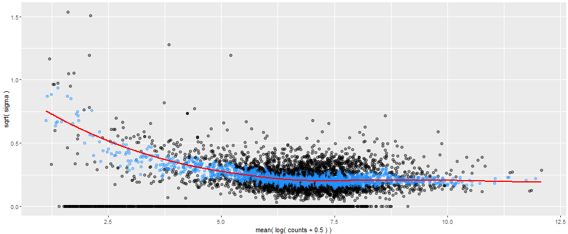
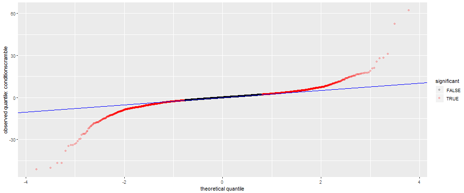

# Getting Started with Sleuth

The first step will be to load the files we need.  We will need to tell the computer where to find
each replicate kallisto output and the relationship table.

```
#----------|to load files|----------#

# Different runs
sample_id <- dir(file.path("..", "sleuth_files"))

# each replicate loaded
kal_dirs <- sapply(sample_id, function(id)
  file.path(main_work_dir, "sleuth_files", id))
kal_dirs

# relationship table
s2c <- read.table(file.path(main_work_dir, "hiseq_info.txt"),
                  header = T, stringsAsFactors = F)
s2c
```

To help sleuth understand what we wish to do, we will need to trim the relationship tabl.e 

```
#### NOTE TO STUDENTS:
#### Recall that in the below case, :: means use the function 'select'
#### in the library 'dplyr'
s2c <- dplyr::select(s2c, sample = run_accession, condition)
s2c

s2c <- dplyr::mutate(s2c, path = kal_dirs)
s2c
```

We will now make a sleuth object.  The functions called here come out of the sleuth library we
attached earlier.

```
#----------|making sleuth object (SO)|----------#

so <- sleuth_prep(s2c, ~ condition)

so <- sleuth_fit(so)

so <- sleuth_wt(so, 'conditionscramble')
```

The final step would be to call the R shiny app to help visualize the data.  If you wish to bypass
this, the data can be saved using models(), and manipulated to your preference.

```
# Visualize
sleuth_live(so)

# to save data
models(so)
```

# Understanding sleuth output

An easy way to study the output of sleuth is to use the sleuth shiny app.  The app will
auto-generate graphs for easy study of the results.

## Quality check

See graphs under diagnostics.  Four options are available:
- bias weights
- mean-variance plot
- scatter plots
- Q-Q plot

Mean-variance plot



Q-Q plot



## Understanding the data

To analyses your data, plots are available under the tab 'analysis'
